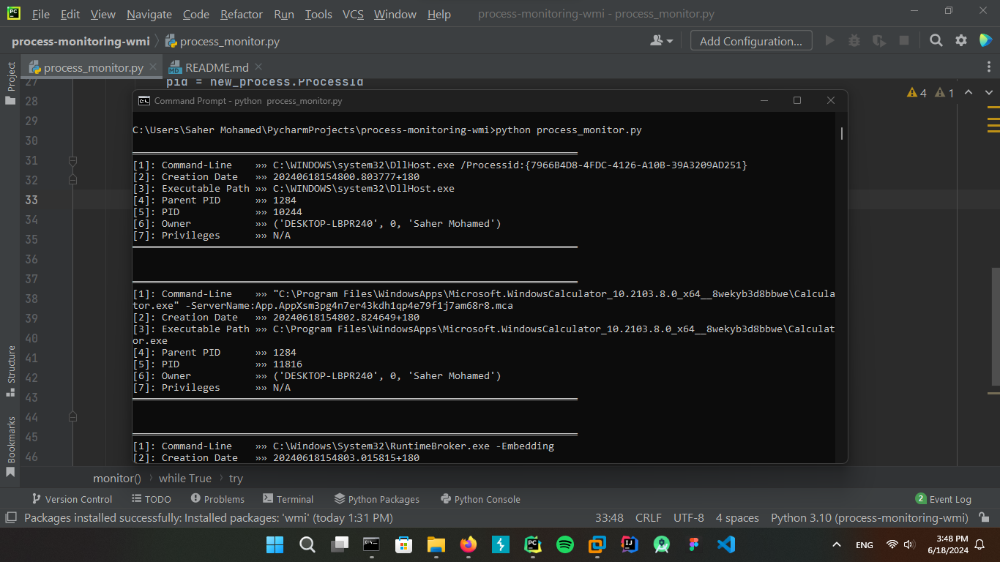

# Process Monitor

## Overview

Process Monitor is a Python script that monitors the creation of new processes on a Windows system using the WMI (
Windows Management Instrumentation) interface. It logs details about each new process to a CSV file and displays
information on the console.

## Features

- Monitors process creation events in real-time
- Logs process details such as command-line, creation date, executable path, parent PID, PID, user owner, and
  privileges (not fully implemented in the provided script)
- Outputs monitored process details to both CSV file `process_monitor_log.csv` and console
- Gracefully handles keyboard interrupts `Ctrl+C` to exit the monitoring loop

## Requirements

- Python 3.x
- `pywin32` library for interacting with Windows API (`win32api`, `win32con`, `win32security`)
- `wmi` library for WMI interaction

## Installation

1. Ensure Python 3.x is installed on your system.
2. Install required Python packages:
    ```commandline
    pip install pywin32 wmi
    ```

## Usage

```commandline
python process_monitor.py
```

- The script will start monitoring process creation events. Press `Ctrl+C` to stop monitoring and exit

## Screenshot



## Acknowledgement

**This python script provided by Black Hat Python - 2nd Edition book for self-learning**
